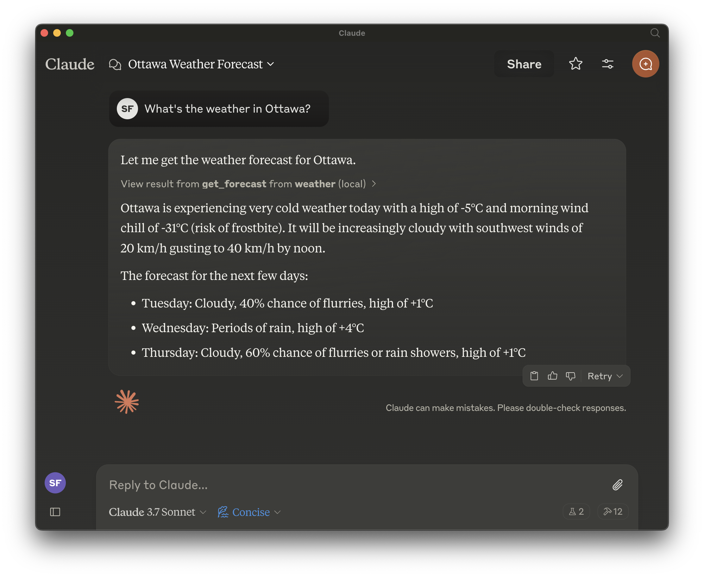

# Weather MCP Server

A Model Context Protocol (MCP) server that provides weather forecast data from the Government of Canada Weather API.

## Features

- Fetch weather forecasts for any location in Canada by providing latitude and longitude
- Easily integrates with Claude Desktop or any MCP-compatible client



## Installation

### Prerequisites

- Python 3.13 or higher
- [mise](https://mise.jdx.dev/) or another Python version manager (optional)

### Installation Steps

1. Clone this repository:
   ```bash
   git clone https://github.com/seanlf/weather-mcp.git
   cd weather-mcp
   ```

2. Set up a virtual environment (optional but recommended):
   ```bash
   python -m venv .venv
   source .venv/bin/activate  # On Windows: .venv\Scripts\activate
   ```

3. Install the package and dependencies:
   ```bash
   pip install -e .
   ```

## Usage

### Running as a standalone server

Run the server directly:

```bash
python weather.py
```

### Integration with Claude Desktop

To integrate with Claude Desktop:

1. Edit your Claude Desktop configuration (typically at `~/Library/Application Support/Claude/claude_desktop_config.json` on macOS):

```json
{
  "mcpServers": {
    "weather": {
      "command": "/path/to/python", 
      "args": [
        "/path/to/weather-mcp/weather.py"
      ]
    }
  }
}
```

2. Restart Claude Desktop to apply changes

### Using with other MCP hosts

To use with other MCP hosts, configure the host to execute `weather.py` using Python 3.13 or higher.

## API Reference

### get_forecast(latitude: float, longitude: float) -> str

Gets a 5-day weather forecast for the specified location.

**Parameters:**
- `latitude`: Latitude of the location
- `longitude`: Longitude of the location

**Returns:**
- A formatted string containing the 5-day forecast

**Example usage in Claude:**
```
Please get the weather forecast for Ottawa, Canada (45.4215, -75.6972)
```

## Development

### Running Tests

```bash
pytest
```

### Contributing

Contributions are welcome! Please feel free to submit a Pull Request.

## License

This project is licensed under the terms of the license included in the repository.
